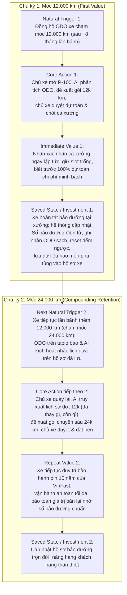

# Metrics Pack — P-100: EV After-Sales AI Agent
**Khóa học:** AI20K Track 1 — Day 20: Product Metrics Lab  
**Học viên:** Lưu Xuân Dũng · **Mã học viên (MHV):** 2A202602746  
**Dự án:** P-100 — EV After-Sales AI Agent (Hệ thống hỗ trợ chăm sóc sau bán & lập kế hoạch bảo dưỡng xe điện VinFast)  
**Tên repository nộp:** `Track1_Day20_2A202602746_LuuXuanDung`  

---

## 00 — Dự án, persona, core job

| Mục | Nội dung chi tiết |
|---|---|
| **Dự án** | **P-100 — EV After-Sales AI Agent**: Hệ thống hỗ trợ chăm sóc sau bán và lập kế hoạch bảo dưỡng xe điện VinFast. Ứng dụng AI Agent (LangGraph + RAG) kết hợp dịch vụ nghiệp vụ backend để phân tích mốc km, đề xuất hạng mục bảo dưỡng chính hãng, lập dự toán chi phí minh bạch và điều phối đặt lịch hẹn xưởng có xác nhận của Cố vấn dịch vụ (Human-in-the-loop). |
| **Persona** | **Anh Nam (36 tuổi) — Chủ sở hữu xe điện VinFast VF 8** tại Hà Nội. • *Đặc điểm:* Sử dụng xe đi làm hàng ngày và chở gia đình cuối tuần (~1.500 km/tháng). Bận rộn, coi trọng độ an toàn vận hành của xe và pin. • *Nỗi đau (Pain points):* Không nhớ chính xác xe mình đến mốc nào thì phải thay gì; sợ bị các xưởng dịch vụ "vẽ bệnh" hoặc phát sinh chi phí mập mờ; rất ngại việc phải gọi điện thoại nhiều lần hoặc mang xe đến xưởng rồi phải ngồi chờ đợi hàng tiếng đồng hồ vì hết chỗ tiếp nhận. |
| **Core job** | *(Viết bằng lời của người dùng):* ***"Khi xe tôi sắp chạm mốc km bảo dưỡng định kỳ (hoặc nghi ngờ có vấn đề kỹ thuật), tôi muốn biết chính xác xe cần làm những hạng mục gì, chi phí hết bao nhiêu tiền minh bạch chuẩn hãng, và chốt được lịch hẹn tại xưởng dịch vụ còn ca trống thuận tiện nhất mà không phải gọi điện chờ đợi hay lo bị phát sinh chi phí mập mờ tại xưởng."*** |

---

## 01 — Core Action Card + kết quả tự kiểm 5 tiêu chí

### 1. Phân biệt bốn khái niệm nền tảng

| Khái niệm | Câu hỏi cốt lõi | Định nghĩa áp dụng cho use case P-100 |
|---|---|---|
| **Core job** | User cố hoàn thành việc gì? | Chủ động đưa xe đi bảo dưỡng đúng chuẩn hãng, đúng hạn, minh bạch chi phí và tiết kiệm tối đa thời gian chờ đợi. |
| **Core action** | User làm gì trong sản phẩm để tiến tới giá trị? | Xem phân tích mốc bảo dưỡng của AI, duyệt danh mục hạng mục và bấm **"Xác nhận đặt lịch hẹn xưởng"** (`confirm_maintenance_booking`). |
| **Core value** | User nhận lợi ích gì? | Xe được bảo dưỡng an toàn, duy trì bảo hành pin/xe chính hãng, chi phí khớp đúng dự toán, không lãng phí thời gian chờ tại xưởng. |
| **Core value event** | Sự kiện nào chứng minh giá trị đã xảy ra? | Xe hoàn tất bảo dưỡng tại xưởng dịch vụ, nhận biên bản nghiệm thu và bàn giao xe (`service_maintenance_completed` / `status = COMPLETED`). |

### 2. Core Action Card

| Thành phần | Chi tiết cho P-100 |
|---|---|
| **Target user** | Chủ sở hữu xe điện VinFast (đã đăng nhập và liên kết hồ sơ xe vào hệ thống). |
| **Core job** | Lập kế hoạch bảo dưỡng xe điện chuẩn hãng, rõ ràng chi phí và chốt lịch hẹn xưởng dịch vụ thuận tiện. |
| **Core action** | Phê duyệt kế hoạch dịch vụ (chọn hạng mục định kỳ/tùy chọn) và bấm xác nhận gửi đặt lịch hẹn xưởng (`confirm_maintenance_booking`). |
| **Object** | Kế hoạch bảo dưỡng (`MaintenancePlan`) và Lịch hẹn dịch vụ (`ServiceBooking`). |
| **Preconditions** | 1. Xe đã được kết nối hồ sơ và ghi nhận ODO hiện tại. 2. AI Agent đã phân tích dữ liệu mốc km, xuất ra danh sách hạng mục bắt buộc/tùy chọn kèm bảng dự toán chi phí minh bạch. 3. Hệ thống hiển thị danh sách xưởng dịch vụ và ca giờ (slot) còn quota khả dụng. |
| **Completion rule** | Người dùng bấm nút xác nhận đặt lịch trên giao diện; hệ thống backend khóa quota ca xưởng, tạo bản ghi booking thành công trong cơ sở dữ liệu với trạng thái `PENDING_CONFIRMATION` kèm `operation_key` duy nhất và danh sách hạng mục đã chọn. |
| **Core value** | Loại bỏ hoàn toàn sự mập mờ về giá cả và quy trình, đảm bảo an toàn pin xe, chủ động tuyệt đối về thời gian di chuyển và làm việc. |
| **Evidence of value** | Xưởng dịch vụ tiếp nhận xe, hoàn thành các hạng mục theo đúng kế hoạch và phát hành biên bản bàn giao xe hoàn tất dịch vụ (`booking_status = COMPLETED`). |
| **Candidate event** | • Core action tracking event: `maintenance_booking_submitted` • Core value tracking event: `service_maintenance_completed` |

### 3. Tự kiểm 5 tiêu chí Core Action (Gate 1)

| Tiêu chí | Đạt/Chưa đạt | Lý do biện luận chi tiết |
|---|:---:|---|
| **1. Gần core value** | **ĐẠT** | Việc chốt kế hoạch bảo dưỡng và đặt lịch hẹn là hành động cam kết cao nhất trên nền tảng số để chiếc xe thực sự được đưa vào xưởng vật lý. Nếu người dùng chỉ mở app hỏi chatbot hay tra cứu cẩm nang mà không chốt booking thì giá trị cốt lõi (xe được bảo dưỡng an toàn) không thể xảy ra. |
| **2. Lặp lại được khi nhu cầu quay lại** | **ĐẠT** | Xe điện bắt buộc phải bảo dưỡng theo các mốc kỹ thuật định kỳ (mỗi 12.000 km hoặc mỗi 12 tháng). Khi xe lăn bánh đến mốc tiếp theo (24.000 km, 36.000 km...), nhu cầu này xuất hiện lại và người dùng tiếp tục thực hiện đúng core action này. |
| **3. Quan sát được thời điểm hoàn tất** | **ĐẠT** | Hành vi hoàn tất tại khoảnh khắc giao dịch tạo booking thành công ở backend (`POST /api/v1/bookings` trả về `201 Created`, sinh `booking_id`, gán `operation_key` và ghi nhận timestamp chính xác trong PostgreSQL). |
| **4. Có ý nghĩa: Tăng hành vi phản ánh sản phẩm tốt hơn** | **ĐẠT** | Số lượng booking được xác nhận tăng lên chứng minh AI Agent tư vấn mốc chính xác, dự toán chi phí minh bạch đáng tin cậy và UX thuận tiện, giúp giải quyết triệt để rào cản tâm lý của chủ xe so với kênh truyền thống. |
| **5. Team có thể tác động để cải thiện hành vi** | **ĐẠT** | Product team có thể cải thiện độ chính xác phân tích của AI, làm bảng bóc tách chi phí trực quan hơn, tối ưu gợi ý xưởng gần nhất còn slot trống và kích hoạt thông báo nhắc lịch thông minh đúng thời điểm xe sắp chạm mốc km. |

**Kết luận Gate 1:** Đạt 5/5 tiêu chí. Core action là hành vi giao dịch giá trị thực, không phải thao tác bề mặt (mở app, đọc tin, chat thử nghiệm).

---

## 02 — Action Nature Card + kết luận cadence

### 1. Action Nature Card

| Thành phần | Câu hỏi tự trả lời & Phân tích thực tế cho P-100 |
|---|---|
| **Actor** | Chủ sở hữu xe cá nhân (Individual Vehicle Owner) thao tác trực tiếp trên ứng dụng. |
| **Intent** | Muốn xe được kiểm tra, bảo dưỡng đúng mốc kỹ thuật để đảm bảo an toàn pin điện, duy trì hiệu lực bảo hành 10 năm của hãng VinFast, và tránh hỏng hóc tốn kém. |
| **Trigger** | **Kích hoạt tự nhiên bên ngoài:** Số km trên đồng hồ ODO xe tăng dần qua thời gian di chuyển hàng ngày chạm các mốc (12.000, 24.000, 36.000 km...) hoặc mốc tròn năm (12 tháng). Được hỗ trợ kích hoạt bởi hệ thống khi AI phát hiện ODO xe sắp chạm mốc. |
| **Effort** | **Trung bình (3–5 phút):** Đọc hiểu danh mục hạng mục bảo dưỡng do AI đề xuất, kiểm tra dự toán chi phí minh bạch, chọn xưởng và ca hẹn phù hợp, xác nhận đặt lịch. |
| **Value timing** | **Hai giai đoạn:** 1. *Giá trị tức thì (Immediate value):* Sự an tâm ngay lập tức khi biết rõ chi phí và giữ chắc ca hẹn tại xưởng. 2. *Giá trị trọn vẹn (Full value):* Nhận được khi xe hoàn tất bảo dưỡng tại xưởng sau 1–3 ngày. |
| **State** | Hồ sơ bảo dưỡng điện tử của xe được lưu trữ vĩnh viễn trên hệ thống (lịch sử sửa chữa, phụ tùng đã thay, ODO tại thời điểm làm dịch vụ, chứng nhận bảo hành pin). |
| **Dependency** | Phụ thuộc vào công suất tiếp nhận của xưởng dịch vụ (slot ca trống) và sự tiếp nhận, xác nhận của Cố vấn dịch vụ (quy trình Human-in-the-loop). |
| **Repeat condition** | Xe tiếp tục vận hành thêm 12.000 km hoặc sau 12 tháng tiếp theo (chu kỳ hao mòn cơ học và quy định bảo hành của nhà sản xuất). |

### 2. Tự kết luận cadence (Gate 2)

- **Dạng hành vi:** Tiến trình tích lũy theo chu kỳ định kỳ tự nhiên (Milestone & Periodic Cycle) kết hợp phản ứng theo sự kiện kỹ thuật.
- **Kết luận quy chuẩn:**
  > *"Đối với **Chủ xe điện VinFast**, core action **Xác nhận kế hoạch và đặt lịch bảo dưỡng định kỳ** thường xuất hiện **mỗi 6–12 tháng (tương ứng mỗi 12.000 km lăn bánh)** vì đây là chu kỳ bảo dưỡng kỹ thuật bắt buộc của xe điện VinFast và tốc độ di chuyển trung bình của chủ xe cá nhân là 1.000–2.000 km/tháng. Do đó, nhịp đo phù hợp là **Semi-annual / Annual window (khung đo retention 6 tháng và 12 tháng)** ở cấp **mỗi phương tiện / tài khoản chủ xe (Vehicle / Owner level)**."*

- **Bi biện luận chống Anti-pattern (Nature vs Nurture):**
  Bảo dưỡng xe ô tô là dịch vụ chu kỳ thấp (low-frequency), giá trị cao (high-value/high-stakes). Việc ép buộc đo lường theo ngày/tuần (DAU/WAU) hoặc dùng push notification spam để kéo người dùng vào app hàng tuần là hoàn toàn sai lệch bản chất tự nhiên (nature) của sản phẩm. Người dùng không có nhu cầu và không thể đi bảo dưỡng xe mỗi tuần. Mọi nỗ lực nuôi dưỡng (nurture) phải tôn trọng và bám sát nhịp tích lũy ODO tự nhiên của phương tiện.

---

## 03 — Metric System: activation / engagement / NSM / leading / counter

### 1. Activation

| Thành phần | Định nghĩa cụ thể cho P-100 |
|---|---|
| **Start event** | `vehicle_profile_connected`: Chủ xe đăng nhập thành công và hoàn tất kết nối hồ sơ xe điện (VIN, dòng xe, ODO ban đầu). |
| **Activation event** | `first_maintenance_plan_viewed_and_confirmed`: Lần đầu tiên xem phân tích kế hoạch bảo dưỡng minh bạch của AI và bấm xác nhận đặt lịch hẹn xưởng thành công (`maintenance_booking_submitted`). |
| **Time window** | **14 ngày** kể từ khi kết nối xe (đối với xe đã gần hạn mốc) HOẶC **7 ngày** kể từ khi AI phát hiện và gửi thông báo xe chạm mốc ODO bảo dưỡng. |

*Lưu ý phân biệt Active ≠ Activated:* Đăng nhập, mở app hay hỏi chatbot vu vơ chỉ là "Active bề mặt". Người dùng chỉ được coi là "Activated" khi đã trải nghiệm trọn vẹn giá trị đầu tiên (first value) của P-100: AI giải tỏa nỗi lo mập mờ chi phí và chốt được lịch xưởng thành công.

### 2. Engagement

Chọn 2 góc tiếp cận phù hợp nhất với bản chất sản phẩm:

| Góc đo lường | Chỉ số cụ thể | Cách đo lường & Ý nghĩa nghiệp vụ |
|---|---|---|
| **Depth (Độ sâu / Giá trị mỗi lần)** | **Tỷ lệ duyệt dự toán chi phí minh bạch** (`plan_cost_transparency_review_rate`) | `% các lượt đặt lịch mà người dùng chủ động mở xem chi tiết bóc tách chi phí từng hạng mục (phụ tùng + nhân công) trước khi xác nhận`. Đo lường mức độ người dùng đón nhận và tin cậy tính năng cốt lõi "xóa bỏ mập mờ chi phí" của AI. |
| **Frequency (Tần suất trong natural cadence)** | **Tỷ lệ bảo dưỡng đúng hạn trên số xe đến mốc** (`on_time_milestone_booking_rate`) | `Số xe đến mốc km trong năm có phát sinh booking hoàn tất / Tổng số xe chạm mốc km trong năm`. Đo lường mức độ bao phủ và tính thường trực của giải pháp trong vòng đời phương tiện. |

### 3. North Star Metric (NSM)

- **Công thức 3 thành phần cấu thành:**
  $$\text{NSM} = \text{Unit of Value} + \text{Quality Threshold} + \text{Frequency}$$
  - `Unit of value`: Lượt xe hoàn tất dịch vụ bảo dưỡng tại xưởng (`service_maintenance_completed`).
  - `Quality threshold`: Đạt độ chính xác dự toán chi phí (chênh lệch giữa chi phí thực tế trên hóa đơn bàn giao so với dự toán ban đầu của AI $\le 5\%$) VÀ không có khiếu nại phát sinh ngoài danh mục đã duyệt.
  - `Frequency`: Tổng hợp theo **Tháng / Quý** trên toàn mạng lưới xưởng dịch vụ.

- **Tên và định nghĩa chính thức của NSM:**
  > **Monthly Completed Accurate-Cost Maintenances (Số lượt xe hoàn tất bảo dưỡng đúng hạn và khớp dự toán chi phí mỗi tháng).**

- **Lý do chọn NSM này:**
  Chỉ số này phản ánh trọn vẹn giá trị win-win-win cho cả 3 bên:
  1. *Chủ xe:* Xe được bảo dưỡng an toàn, đúng hạn, không bị "chém giá" hay phát sinh chi phí mập mờ.
  2. *Xưởng dịch vụ & Cố vấn:* Nhận được nguồn khách hàng đều đặn, thông tin xe và hạng mục đã được chuẩn bị trước qua AI, giảm thời gian giải thích và tư vấn thủ công.
  3. *Nền tảng P-100:* Chứng minh năng lực của AI Agent trong việc dự toán chính xác và điều phối giao dịch thành công. Chỉ số này không thể bị thao túng bằng thủ thuật tăng lượt chat ảo hay spam thông báo.

### 4. Leading Indicators (Tối đa 3)

| Chỉ số dẫn dắt (Leading Indicator) | Công thức / Định nghĩa | Lý do dự báo core action lặp lại |
|---|---|---|
| **1. Tỷ lệ mở xem kế hoạch bảo dưỡng khi nhận cảnh báo ODO** (`milestone_alert_to_plan_open_rate`) | `Số lượt mở xem chi tiết kế hoạch / Số thông báo cảnh báo chạm mốc ODO được gửi` | Dự báo mức độ chú ý và nhu cầu phát sinh của chủ xe; tỷ lệ này cao cho thấy thông báo của AI đúng thời điểm và đáng tin cậy. |
| **2. Tỷ lệ chuyển đổi từ xem kế hoạch sang đặt lịch** (`plan_view_to_booking_submitted_rate`) | `Số booking được xác nhận gửi đi / Số kế hoạch bảo dưỡng được mở xem chi tiết` | Phản ánh mức độ hài lòng về tính minh bạch của bảng dự toán chi phí và độ thuận tiện của ca xưởng gợi ý; dự báo lượng xe sắp vào xưởng. |
| **3. Tỷ lệ xưởng phản hồi và chốt ca trong 15 phút** (`workshop_sla_confirmation_speed_rate`) | `Số booking được xưởng xác nhận trong < 15 phút / Tổng số booking gửi đến xưởng` | Phản ánh hiệu quả phối hợp Human-in-the-loop; xưởng phản hồi càng nhanh thì tỷ lệ khách hàng giữ lịch và không hủy hẹn càng cao. |

### 5. Counter-Metrics (Chỉ số đối trọng)

| Counter-Metric | Định nghĩa & Ngưỡng kiểm soát | Mục đích đối trọng (Điều không được xấu đi) |
|---|---|---|
| **1. Tỷ lệ sai lệch chi phí thực tế so với dự toán** (`cost_variance_rate`) | `|Chi phí thực tế - Chi phí dự toán AI| / Chi phí dự toán AI` *Ngưỡng an toàn: $\le 5\%$* | Ngăn chặn việc AI "hạ thấp giá dự toán ảo" để lừa người dùng đặt lịch nhưng khi đến xưởng thì chi phí bị đội lên, phá hủy niềm tin thương hiệu. |
| **2. Tỷ lệ hủy lịch hoặc không đến hẹn** (`cancellation_and_no_show_rate`) | `(Số booking bị hủy + Số lượt vắng mặt) / Tổng số booking đã xác nhận` *Ngưỡng an toàn: $\le 8\%$* | Đảm bảo tăng trưởng số lượng booking là tăng trưởng thực chất, không phải do UX ép buộc dẫn đến khách bỏ hẹn, gây lãng phí năng lực xưởng. |

**Kết luận Gate 3:** Activation đủ 3 trường; Engagement chọn đúng 2 góc; NSM đủ 3 thành phần; có đủ 3 Leading indicators và 2 Counter-metrics chặt chẽ.

---

## 04 — Retention Definition: 6 thành phần

| Thành phần | Định nghĩa vận hành cho P-100 | Giải thích rationale nghiệp vụ |
|---|---|---|
| **1. Unit** | **Phương tiện (Vehicle / VIN)** gắn với **Tài khoản chủ xe (Owner Account)** | Đơn vị bảo dưỡng kỹ thuật gắn liền với chiếc xe cụ thể, một chủ xe có thể sở hữu nhiều xe. |
| **2. Cohort entry** | `first_service_maintenance_completed` | Event đánh dấu xe hoàn tất chu kỳ bảo dưỡng đầu tiên tại xưởng qua nền tảng P-100. |
| **3. Return event** | `repeat_service_maintenance_completed` | Event đánh dấu xe quay lại và hoàn tất chu kỳ bảo dưỡng định kỳ tiếp theo tại xưởng. |
| **4. Window** | **Semi-annual / Annual Bracket (180 – 365 ngày)** | Khung thời gian tự nhiên để xe tích lũy thêm 12.000 km tiếp theo theo cường độ vận hành thông thường. |
| **5. Threshold** | Tối thiểu **1 lần** hoàn tất dịch vụ bảo dưỡng trong window khi ODO tăng đủ $\ge 10.000\text{ km}$ | Đảm bảo sự quay lại là do chu kỳ bảo dưỡng định kỳ tự nhiên, loại trừ các trường hợp xe vào xưởng sửa chữa phát sinh ngắn hạn. |
| **6. Segment** | **Phân nhóm theo cường độ vận hành:** • *Segment 1: Xe gia đình/cá nhân* (1.000 – 1.500 km/tháng → chu kỳ ~9–12 tháng). • *Segment 2: Xe dịch vụ/kinh doanh* (> 2.500 km/tháng → chu kỳ ~4–6 tháng). | Cường độ sử dụng xe quyết định tốc độ chạm mốc km; không thể gộp chung xe dịch vụ chạy 3.000 km/tháng với xe gia đình chạy 800 km/tháng vào cùng một khung thời gian so sánh. |

---

## 05 — Product Loop: 2 chu kỳ + metric hypothesis

### 1. Mô hình Product Loop qua 2 chu kỳ (Milestone & Vehicle Progress Loop)

### 2. Trả lời câu hỏi phản biện: Nếu bỏ push notification, người dùng còn lý do gì để quay lại?
*Lý do tự nhiên nội tại hoàn toàn độc lập với notification:*
1. **Lời nhắc nhở vật lý trực tiếp từ chiếc xe:** Ô tô là phương tiện di chuyển hàng ngày và là tài sản lớn. Đồng hồ ODO trên bảng taplo xe hiển thị mỗi ngày và đèn cảnh báo bảo dưỡng của xe VinFast là trigger tự nhiên mạnh nhất, nhắc nhở chủ xe về sự an toàn của gia đình và điều kiện bảo hành pin đắt giá.
2. **Dữ liệu được tích lũy (Saved State & Data Moat):** Toàn bộ lịch sử bảo dưỡng, tình trạng hao mòn pin, các phụ tùng đã thay và chứng nhận kỹ thuật đều được lưu trữ tập trung tại P-100. Người dùng quay lại vì đây là "cuốn sổ sức khỏe điện tử" duy nhất của chiếc xe giúp họ được bảo hành chính hãng và bảo toàn giá trị thanh khoản khi chuyển nhượng xe.

### 3. Metric Hypothesis (Bắt buộc)
> *"Nếu **Milestone & Vehicle Progress Loop** này hoạt động hiệu quả, metric **Annual Milestone Retention Rate** (Tỷ lệ xe quay lại hoàn tất bảo dưỡng mốc 24.000 km sau khi đã hoàn thành mốc 12.000 km) sẽ **tăng từ 48% lên trên 72% trong vòng 12 tháng**, vì dữ liệu bảo dưỡng đã lưu từ lần 1 giúp AI cá nhân hóa chính xác danh mục cần làm, loại bỏ 100% ma sát phải tra cứu sổ tay, và sự minh bạch chi phí từ lần trước tạo dựng niềm tin tuyệt đối cho chủ xe."*

---

## 06 — Tracking nhanh: 4–8 events + ít nhất 2 acceptance criteria

### 1. Bảng danh mục Core Tracking Events (Chuẩn cấu trúc `object_action`)

| Tên event (`object_action`) | Ý nghĩa: Điều đã xảy ra | Thời điểm ghi nhận chính xác | Metric Phase 3 sử dụng |
|---|---|---|---|
| `vehicle_profile_connected` | Chủ xe đăng nhập và kết nối/chọn hồ sơ xe điện thành công. | Khi API `/api/v1/vehicles` trả về hồ sơ xe hợp lệ kèm ODO ban đầu và lưu vào state. | **Activation Start Event** |
| `maintenance_plan_generated` | AI Agent phân tích ODO và sinh thành công gói kế hoạch bảo dưỡng kèm bảng dự toán chi phí. | Khi LangGraph node `generate_plan` hoàn tất và ghi bản ghi `MaintenancePlan` vào DB. | **Leading Indicator 1** (`milestone_alert_to_plan_open_rate`) |
| `maintenance_plan_viewed` | Chủ xe mở xem chi tiết các hạng mục bắt buộc/tùy chọn và bóc tách chi phí. | Khi màn hình chi tiết kế hoạch bảo dưỡng render thành công trên giao diện Chủ xe. | **Engagement Depth** (`plan_cost_transparency_review_rate`) |
| `maintenance_booking_submitted` | Chủ xe bấm xác nhận gói dịch vụ và gửi yêu cầu đặt lịch hẹn xưởng thành công (**Core Action Event**). | Khi API `POST /api/v1/bookings` phản hồi `201 Created` và commit bản ghi với trạng thái `PENDING_CONFIRMATION`. | **Activation Event**, **Leading Indicator 2** (`plan_view_to_booking_submitted_rate`) |
| `workshop_booking_confirmed` | Cố vấn xưởng dịch vụ duyệt và xác nhận tiếp nhận ca hẹn thành công (HITL). | Khi Cố vấn bấm duyệt trên Cổng Cố vấn và DB cập nhật booking sang trạng thái `CONFIRMED`. | **Leading Indicator 3** (`workshop_sla_confirmation_speed_rate`) |
| `service_maintenance_completed` | Xe hoàn tất bảo dưỡng tại xưởng, cố vấn chốt hóa đơn và bàn giao xe (**Core Value Event**). | Khi booking chuyển trạng thái sang `COMPLETED` trong DB kèm hóa đơn nghiệm thu (`final_cost`). | **North Star Metric (NSM)**, **Cohort Entry & Return Event** |
| `booking_cancelled_or_no_show` | Lịch hẹn bị hủy bởi khách hàng/xưởng hoặc khách không đến đúng hẹn. | Khi trạng thái booking chuyển sang `CANCELLED` hoặc `NO_SHOW` trong DB. | **Counter-Metric 2** (`cancellation_and_no_show_rate`) |

### 2. Acceptance Criteria cho Tracking Telemetry

- **Acceptance Criteria 1 (Chỉ ghi nhận khi hành vi thực sự hoàn tất ở backend, không bắt sự kiện ở click UI):**  
  Event `maintenance_booking_submitted` chỉ được hệ thống telemetry phát ra khi và chỉ khi API endpoint `POST /api/v1/bookings` phản hồi HTTP status code `201 Created`, cơ sở dữ liệu đã commit thành công bản ghi `ServiceBooking` với trạng thái `PENDING_CONFIRMATION`, sinh kèm `booking_id` và `operation_key` duy nhất. Tuyệt đối không được bắn event này khi người dùng vừa nhấp chuột vào nút "Xác nhận đặt lịch", khi đang hiển thị dialog xác nhận, hoặc khi request bị lỗi mạng/lỗi validation (HTTP 4xx/5xx).

- **Acceptance Criteria 2 (Chống trùng lặp dữ liệu do reload, retry hoặc polling):**  
  Event `service_maintenance_completed` chỉ được hệ thống telemetry ghi nhận đúng 1 lần duy nhất khi và chỉ khi trường `status` của booking chuyển dịch trạng thái từ `IN_PROGRESS` sang `COMPLETED` cùng chữ ký xác nhận của Cố vấn dịch vụ. Mọi hành vi làm mới trang (page reload) của chủ xe trên giao diện `/owner`, thao tác đồng bộ lại lịch sử hoặc các lượt truy vấn định kỳ (polling) từ frontend tuyệt đối không được sinh thêm event trùng lặp (Idempotent tracking dựa trên khóa kết hợp `booking_id + status_transition_id`).

---

## Tự kiểm định cuối (Gate 5 Checklist)

- [x] **Core action thực sự là hành vi tạo value:** Đặt lịch bảo dưỡng kèm kế hoạch là cam kết đưa xe vào xưởng, phân biệt hoàn toàn với thao tác UI mở app/chat thử.
- [x] **Activation xác nhận core value:** Kích hoạt tính từ khi xem kế hoạch minh bạch và submit booking thành công, không tính việc onboarding/login đơn thuần.
- [x] **Frequency phù hợp nhu cầu thật:** Nhịp đo 6–12 tháng dựa trên chu kỳ ODO 12.000 km, không áp đặt DAU/WAU phản cảm.
- [x] **Loop có reason to return ngoài notification:** ODO taplo trên xe và giá trị tích lũy của Sổ bảo dưỡng điện tử thúc đẩy người dùng tự nhiên quay lại.
- [x] **Retention window phù hợp cadence:** Đo lường theo khung 180–365 ngày kèm điều kiện tăng ODO $\ge 10.000\text{ km}$.
- [x] **Mọi event map về một metric:** Cả 7 event đều được gắn kết trực tiếp với Activation, Engagement, NSM, Leading indicators hoặc Counter-metrics.
- [x] **Mọi metric có event đủ để tính:** Không có chỉ số nào bị thiếu nguồn dữ liệu tracking.

---

## Revision & Rationale Log

- **Quyết định 1 (Từ chối DAU/WAU & lượt chat AI):** Trong phiên thảo luận thiết kế ban đầu, có ý kiến đề xuất đo lường số lượt hội thoại với AI Agent hàng tuần. Quyết định của tôi là **bác bỏ**, vì P-100 là công cụ giải quyết bài toán kỹ thuật xe hơi, không phải ứng dụng mạng xã hội. Ép người dùng chat với bot khi xe không có nhu cầu bảo dưỡng là tạo ra tương tác rác. Nhịp đo phải là Semi-annual/Annual gắn với ODO.
- **Quyết định 2 (Gắn chất lượng dự toán chi phí vào NSM):** Không chọn NSM chỉ là "Số lượng booking được tạo", vì booking có thể bị hủy hoặc khách đến xưởng bị tính tiền chênh lệch quá nhiều gây phẫn nộ. NSM bắt buộc phải có điều kiện chất lượng: xe hoàn tất dịch vụ với mức sai lệch chi phí $\le 5\%$ so với dự toán ban đầu của AI.
